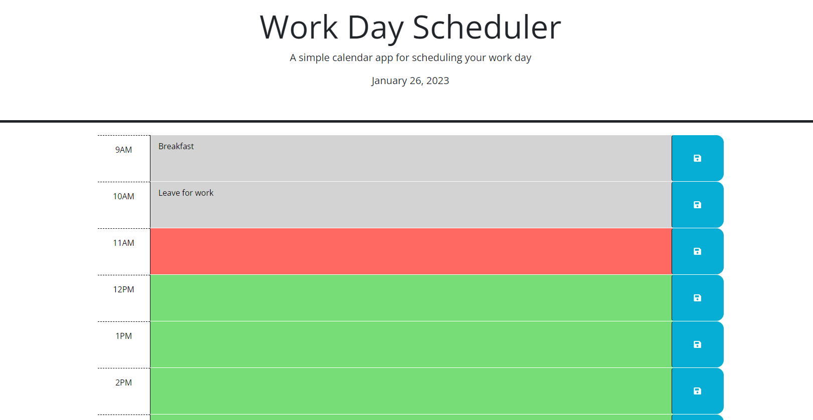

# Day-Planner

## Description

This program is a daily planner in which the user can add notes to various time blocks between 9-5. The text that is added to the time blocks can be saved by the user to local storage allowing them to leave the page and refer back to them later, upon reloading the website. Users could use this to set reminders for later in the day or note things down that happened during the day allowing them to save their thoughts somewhere. The time blocks are also colour coded to show whether a time block has already past, is current, or has yet to happen yet based on the hour of the day.

## Links

Repository:
https://github.com/JacksonR-K/Day-Planner

Deployed Application:
https://jacksonr-k.github.io/Day-Planner

## Credits

© 2022 edX Boot Camps LLC. - For the starter code

https://stackoverflow.com/questions/3239598/how-can-i-get-the-id-of-an-element-using-jquery